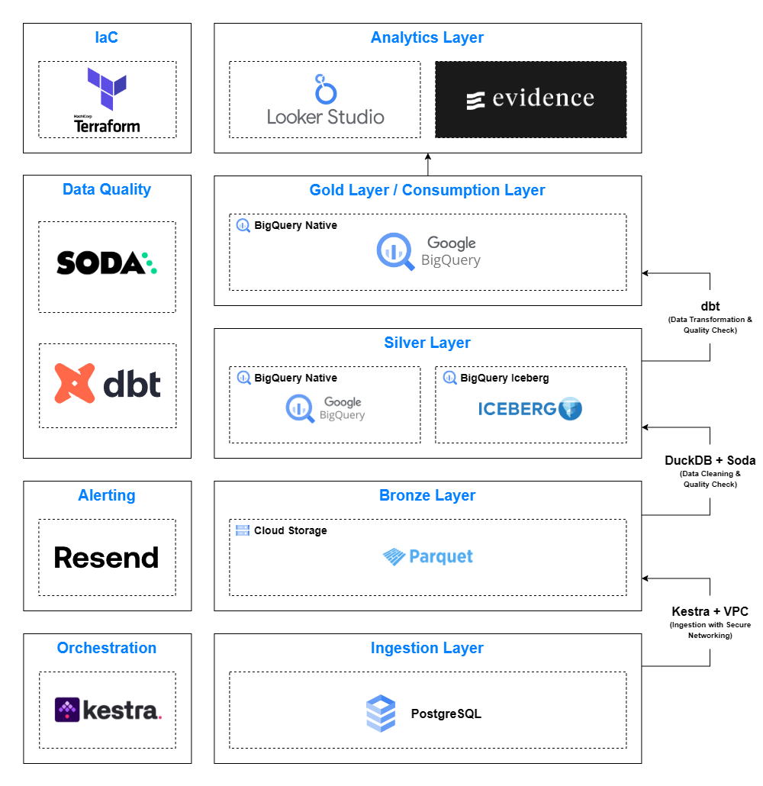

# GCP Batch Data Pipeline

This project implements data pipeline for small-to-medium-scale data platform on GCP using modern tools. The pipeline is designed for batch processing and leverages Kestra, DuckDB, dbt, Iceberg, BigQuery, and Parquet to create a robust and scalable data processing workflow.

## Components

| **Categories**          | **Tools**                              | **Details**                               |
|------------------------|-----------------------------------------|-------------------------------------------|
| Data Source            | Pagila                                  | Sample PostgreSQL database.               |
| Orchestration          | Kestra                                  | Coordinates workflows and tasks.          |
| Ingestion              | Kestra                                  | Manages data ingestion workflows.         |
| Storage                | Google Cloud Storage (GCS) and BigQuery | Stores data using Medallion Architecture. |
| Processing             | DuckDB and dbt+BigQuery                 | Performs data transformation.             |
| Data Quality           | Soda and dbt test                       | Ensures data accuracy and reliability.    |
| Alerting               | Resend                                  | Sends email notifications for issues.     |
| Consumption            | BigQuery                                | Data consumption layer.                   |
| Analytics              | Looker Studio and Evidence              | Analytics and visualizations layer.       |

## Data Flow

